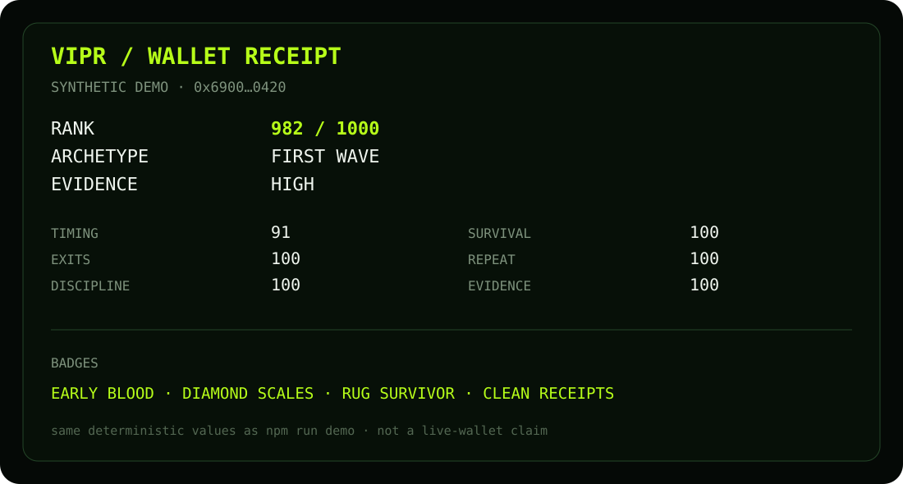
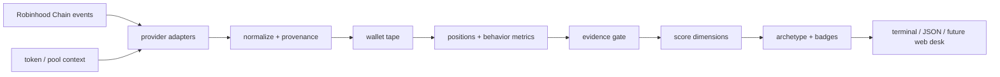

<p align="center">
  
</p>

<p align="center">
  
</p>

<h1 align="center">VIPR</h1>

<p align="center">
  <strong>Wallet reputation for the trenches.</strong><br/>
  Robinhood Chain activity → behavior receipts → wallet traits → reputation profile.
</p>

<p align="center">
  <a href="https://github.com/bondy12/vipr/actions/workflows/ci.yml"></a>
  
  
  
  
  
</p>

<p align="center">
  <a href="#what-vipr-is">What it is</a> ·
  <a href="#sixty-seconds">Demo</a> ·
  <a href="#the-profile">Profile</a> ·
  <a href="#how-it-works">Architecture</a> ·
  <a href="docs/SCORING.md">Scoring</a> ·
  <a href="docs/SAFETY.md">Safety</a>
</p>

---

## What VIPR is

**VIPR is a read-only reputation desk for Robinhood Chain wallets.**

PnL alone is a terrible biography. A wallet can look brilliant because one bag never sold, look awful because an old entry is missing, or look active because dust was pushed into it. VIPR is built around a narrower question:

> **What does this wallet repeatedly do on-chain, and what evidence supports that description?**

The project turns normalized wallet activity into a transparent profile: timing, holding behavior, exits, concentration, repeatability and evidence quality. Every label is supposed to point back to measurable behavior instead of becoming an opaque “smart money” score.

The snake is the meme. **The receipts are the product.**

### Current repository

| Layer | Status | What is here |
| --- | --- | --- |
| Offline demo | **WORKING** | deterministic sample wallet and event tape |
| Behavior metrics | **WORKING** | timing, hold, round-trip, concentration, realized sample metrics |
| Reputation profile | **WORKING** | score breakdown + archetype + badges |
| Text / JSON receipts | **WORKING** | same profile in human and machine-readable form |
| Live Robinhood reader | **SCAFFOLDED** | provider boundary and documented requirements |
| Browser desk | **PLANNED** | profile cards, leaderboards and share cards |
| Telegram bot | **PLANNED** | wallet lookup and movement alerts |

No wallet key, signer or transaction path exists in this foundation.

---

## Sixty seconds

Node 22 or newer.

```bash
git clone https://github.com/bondy12/vipr.git
cd vipr
npm install
npm run demo
npm test
```

Or run the CLI directly:

```bash
node bin/vipr.mjs demo
node bin/vipr.mjs profile demo
node bin/vipr.mjs profile demo --json
node bin/vipr.mjs rules
node bin/vipr.mjs doctor
```

Example demo output:

```text
VIPR / WALLET RECEIPT
0x6900…0420
SYNTHETIC DEMO

RANK          982 / 1000
ARCHETYPE     FIRST WAVE
EVIDENCE      high

TIMING        91
EXITS         100
DISCIPLINE    100
SURVIVAL      100
REPEAT        100
EVIDENCE      100

MEDIAN HOLD   26m
ROUNDTRIPS    0%
EARLY HITS    90%
MAX CONC.     24%

BADGES        EARLY BLOOD · DIAMOND SCALES · RUG SURVIVOR · CLEAN RECEIPTS
```

The bundled demo is synthetic and visibly labelled. It exists so the scoring pipeline can be inspected without pretending production wallet coverage already exists.

<p align="center">
  
</p>

<sub>The receipt above is documentation artwork for the same deterministic values printed by `npm run demo`, not a live-wallet claim.</sub>

---

## The profile

VIPR deliberately separates **behavior**, **evidence quality**, and **presentation**.

```text
0x12F4…9A71
────────────────────────────────────────
VIPR RANK         812 / 1000
ARCHETYPE         FIRST WAVE
EVIDENCE          HIGH

EARLY ENTRY       88
EXIT QUALITY      74
DISCIPLINE        69
SURVIVAL          81
REPEATABILITY     76

MEDIAN HOLD       17m 42s
ROUNDTRIP RATE    18%
EARLY HITS        7 / 11
FULL EXITS        23
MAX CONCENTRATION 31%

BADGES
EARLY BLOOD       repeated early complete samples
DIAMOND SCALES    winners held longer than losers without never-selling bias
RUG SURVIVOR      recovered capital across multiple failed launches
```

### Archetypes

Archetypes are compressed descriptions, not claims about identity or intent.

| Archetype | Behavior pattern |
| --- | --- |
| `FIRST WAVE` | repeatedly arrives early with enough evidence for timing to mean something |
| `SNIPER` | very early, short hold, selective entry pattern |
| `DIAMOND SCALES` | holds conviction names longer while still completing exits |
| `SCAVENGER` | catches dislocations and exits quickly |
| `ROUNDTRIPPER` | frequently gives back large unrealized gains before exit |
| `LATE VENOM` | repeatedly enters after crowd expansion |
| `UNKNOWN` | evidence is too thin or incomplete to classify honestly |

Full definitions live in [`docs/SCORING.md`](docs/SCORING.md).

---

## Behavior, not vibes

VIPR avoids one magic number doing all the work.

| Dimension | What it measures | What can invalidate it |
| --- | --- | --- |
| Timing | entry timing relative to observable market age | missing pool birth / incomplete tape |
| Exit quality | realized exits and large give-back | only open positions available |
| Discipline | concentration, churn and round-trip behavior | transfers mistaken for trades |
| Survival | behavior across failed or illiquid names | no reliable failure state |
| Repeatability | whether a pattern appears across independent positions | sample too small |
| Evidence | completeness and provenance of the rows above | uncertain source attribution |

If a required fact is unknown, VIPR lowers evidence confidence — **it does not fill the blank with zero.**

---

## How it works



The important boundary is between **observations** and **interpretation**. Provider modules collect and normalize. Scoring modules never reach into RPCs or APIs directly.

More: [`docs/ARCHITECTURE.md`](docs/ARCHITECTURE.md).

---

## Project map

```text
.github/workflows/ci.yml     Node 22/24 checks
assets/
  vipr-snake.png             pixel mascot
  banner.svg                 README banner
  terminal-receipt.svg       synthetic receipt artwork
bin/vipr.mjs                 CLI entry point
data/demo-wallet.json        labelled synthetic fixture
docs/
  ARCHITECTURE.md            boundaries and data flow
  BRAND.md                   mascot, voice and visual rules
  COMMANDS.md                CLI surface
  METHODOLOGY.md             what can and cannot be inferred
  PROVENANCE.md              source attribution and evidence rules
  ROADMAP.md                 product sequence
  SAFETY.md                  read-only boundary
  SCORING.md                 dimensions and evidence gates
scripts/verify-readonly.mjs  guard against signing / write primitives
src/
  core/                      scoring, metrics, archetypes
  demo/                      isolated synthetic loader
  providers/                 live-source boundary
  reports/                   text and JSON receipts
  cli.mjs                    command routing
test/                        deterministic Node tests
```

---

## Commands

| Command | Purpose |
| --- | --- |
| `vipr demo` | print the deterministic synthetic walkthrough |
| `vipr profile demo` | score the bundled example wallet |
| `vipr profile demo --json` | emit the same receipt as JSON |
| `vipr rules` | show dimensions, weights and evidence gates |
| `vipr doctor` | show runtime and read-only boundary status |

See [`docs/COMMANDS.md`](docs/COMMANDS.md).

---

## Read-only by construction

VIPR's public intelligence layer should never need custody. The repository intentionally contains no private-key import, seed handling, signing, token approvals, buy/sell execution or transaction submission.

`npm run verify:readonly` scans `src/` for the write/signing primitives this repository has explicitly excluded.

Read [`docs/SAFETY.md`](docs/SAFETY.md) and [`docs/PROVENANCE.md`](docs/PROVENANCE.md) before adding a live provider.

---

## Tests

```bash
npm test
npm run check
```

Tests are deterministic and offline. They cover score bounds, evidence downgrades, archetype selection and badge assignment. CI runs on Node 22 and 24.

---

## Product direction

1. **Receipt** — one wallet, transparent behavior breakdown.
2. **Desk** — search, compare, watchlist, recent changes.
3. **Social identity** — shareable profile cards and earned badges.
4. **Cohorts** — what high-evidence early wallets are doing now without flattening them into one PnL leaderboard.
5. **Protocol API** — reputation dimensions with provenance for other Robinhood Chain products.

See [`docs/ROADMAP.md`](docs/ROADMAP.md).

---

## Brand

**VIPR — Every wallet leaves tracks.**

The mascot is a pixel snake: observant, patient, slightly mischievous. The visual system stays dark and quiet so evidence gets the bright color.

Brand notes: [`docs/BRAND.md`](docs/BRAND.md).

---

## Independence

VIPR is an independent open-source project built around public on-chain data. It is not affiliated with or endorsed by Robinhood Markets, Inc.

Robinhood Chain references describe the public network only. Live adapters should cite exact RPC / indexer / protocol sources and keep source limitations visible in receipts.

## License

MIT — see [`LICENSE`](LICENSE).
